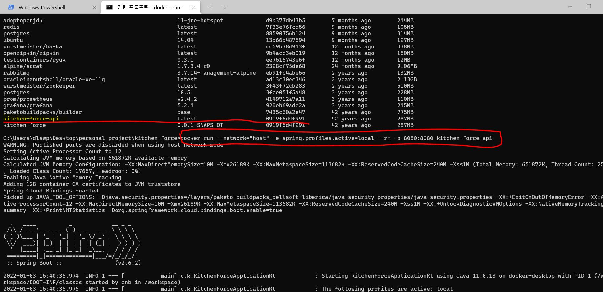

# kitchen-force

## Reference
* Next-step의 ddd-tactical-design 레포지토리의 요구사항을 참고 
  * https://github.com/next-step/ddd-tactical-design
  * 일종의 요식업 POS기 비즈니스라고 보시면 될 것 같습니다.
* 대부분의 구현 기능들은 해당 프로젝트에서 차용해왔으나 일부 변주를 준 기능이 있음.

## Tech Sepc
* Kotlin 1.6.0 (JDK 11)
* gradle 
* SpringBoot 2.6.2
  * Spring Web(Servlet Stack)
    * Rest-Controller 원칙
  * Spring Data Jpa
* RDBMS : MySQL 8.0
  * TEST DB는 H2 인메모리 DB 사용

## ERD
* ```ddl-auto``` 를 활성화 하였으므로 Application의 Entity Model 설계가 변경될 때마다 물리 테이블도 유동적으로 변경 될 것으로 보입니다.


## 스프링 부트 실행 방법
* active profile option을 ```local```로 지정하여 실행


## Docker
> 필수 : 로컬 개발 환경에 각자 OS에 맞는 Docker Engine 구성이 필요함
* 
* 도커 컨테이너 실행하기
```bash
$ cd $PROJECT_DIR
$ docker-compose up -d
```

* 컨테이너 종료
    * Volumn을 초기화 하지 않으면 남은 데이터는 저장됨

```bash
$ docker-compose down
```
* 볼륨 마운트까지 제거시 ```-v``` 옵션 추가
    * 이러면 DB에 저장된 값도 날라감.

```bash
$ docker-compose down -v
```

* 서버 어플리 케이션 도커 빌드(로컬)
  * imagename = kitchen-force-api 
  * 빌드시 자동화 된 테스트 돌리기 추가
  ```bash
  $ ./gradlew clean test bootBuildImage --imageName kitchen-force-api
  $ docker run --network="host" -e spring.profiles.active=local --rm -p 8080:8080 kitchen-force-api
  ```
  * windows10
    * 


### 단위테스트 실행
* github Action workflow와 연동이 되어 테스트 pass가 안되면 PR Merge가 어렵습니다.
* PR을 올리기전 체크 부탁드립니다.
```
$ gradlew test
```


---

## FrontEnd
* 사전 준비사항 : 각자 OS에 맞는 npm 환경이 구성이 되어 있어야 함.
* 기술 스택
  * React + TypeScript
  * ReactHooks
  * UI : Antd

* 실행 방법
```
cd frontend
npm install
npm start run
```
* http://localhost:3000